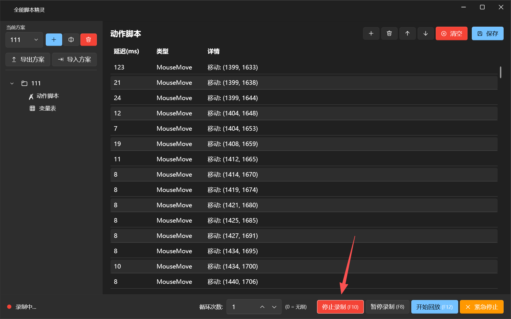

# 全能脚本精灵

全能脚本精灵是一款 Windows 桌面自动化工具，可以录制鼠标、键盘和窗口操作，也可以手动添加“看到图片就点击”“按键操作”“等待文字出现”“读取数据”等步骤。它适合把重复流程做成可复用脚本，比如等待按钮出现后点击、切换窗口、执行快捷键、读取接口数据后继续下一步。



## 下载

请到 GitHub 仓库的 [Releases](https://github.com/yehuili1/xiaoyedj-site/releases) 下载最新版压缩包。

当前版本：`v2.2.2`

下载后解压，双击运行 `全能脚本V2.2.2.exe` 即可。

## v2.2.2 更新重点

- “看到图片就点击”列表改成缩略图显示，点击缩略图可以放大预览。
- 图片动作不再显示自动生成的图片文件名，界面更干净。
- 时间列改成“延迟时间”在前、“超时时间”在后，并且可以直接点击每一行的时间进行修改。
- “看到图片就点击”默认延迟时间为 `1 秒`，默认超时时间为 `10 秒`。
- 添加图片点击动作时，先设置延迟时间，再设置超时时间。
- 添加完一张图片后，会提示是否继续添加下一张，适合连续添加多个图片点击步骤。
- 新增“按键操作”，点击后直接按下要执行的组合键即可自动识别，例如 `Ctrl+A`、`F5`、`Alt+F4`。
- 按键操作支持单独设置延迟时间和超时时间，默认延迟 `1 秒`、超时 `10 秒`。
- 动作列表支持右键单独删除某一步，也保留清空全部。
- “保存”改为“全局保存”，保存后会给出成功提示。
- “导出/导入方案”升级为“导出/导入全局配置”，会包含所有方案、方案设置、快捷键、图片模板等配置。
- 新增软件设置，可调整关闭软件时的行为，也可以设置开机自动启动。
- 关闭确认默认把“彻底退出软件”放在上方，“最小化到托盘”放在下方。
- 迷你窗口会显示当前正在执行的步骤；图片步骤显示预览图，按键步骤显示按键内容，双击可恢复主窗口。
- 方案快捷键采用两段式：不在目标方案时先切换方案，再按一次才执行；已经在目标方案时按一次直接执行。
- 鼠标录制优化了窗口缩放后的坐标换算，改善窗口宽度变化时的点击定位。
- 图片识别升级为 OpenCV 多尺度匹配，提高不同缩放场景下的识别稳定性。
- 支持本地 Windows OCR 文字识别：等待文字出现、看到文字就点击、读取屏幕文字。
- 支持框选识别区域，减少误识别，提高文字查找速度。
- 支持 HTTP/API 类动作：读取数据、提交结果、完成后通知。

## 主要功能

- 录制鼠标移动、点击、滚轮、键盘输入等操作。
- 按方案保存脚本，支持新建、重命名、删除。
- 支持循环次数和播放速度设置。
- 支持看到图片就点击、等待图片出现、等待窗口、切换到窗口。
- 支持按键操作，可自动捕获普通按键、功能键和常见组合键。
- 支持等待文字出现、看到文字就点击、读取屏幕文字。
- 支持读取接口数据、提交接口结果、执行完成后通知。
- 支持全局热键，包括开始/停止录制、暂停录制、开始/停止回放、紧急停止，以及为单个方案绑定快捷键。
- 支持导出/导入全局配置，迁移时可连同图片模板一起打包。
- 支持系统托盘和迷你模式，方便在自动化任务中查看当前执行步骤。
- 运行日志会记录回放、窗口、剪贴板、图片识别、文字识别等关键状态，便于排查问题。

## 快速使用

1. 下载并解压 Release 包。
2. 双击运行 `全能脚本V2.2.2.exe`。
3. 新建一个方案。
4. 点击“开始录制”，完成目标操作后停止录制；也可以在脚本步骤里手动添加动作。
5. 如需图片点击，点击“看到图片就点击”，选择图片后先填延迟时间，再填超时时间。
6. 如需按键操作，点击“按键操作”，在弹出的窗口里直接按下目标按键或组合键，再设置延迟时间和超时时间。
7. 在动作列表里，可以点击缩略图查看大图，也可以直接点击“延迟时间”或“超时时间”修改。
8. 如需删除某一步，可以选中后点删除，也可以右键该步骤单独删除。
9. 调整循环次数、播放速度后，点击“全局保存”。
10. 点击“开始回放”执行脚本。

## 图片点击里的两个时间

- 延迟时间：图片已经出现在屏幕上之后，再等几秒才点击。默认 `1 秒`。
- 超时时间：最多等图片出现多久，超过这个时间还没找到就算失败。默认 `10 秒`。

举例：延迟时间 `1 秒`，超时时间 `10 秒`。意思是软件最多找这张图片 `10 秒`；一旦找到了，不会马上点，而是再等 `1 秒` 才点击。

## 按键操作里的两个时间

- 延迟时间：执行到这一步后，先等几秒再按键。默认 `1 秒`。
- 超时时间：这一步最多允许执行多久。默认 `10 秒`。

举例：添加 `Ctrl+A` 后，软件会在执行到这一步时等待延迟时间，然后自动按下 `Ctrl+A`，完成后继续执行下一步。

## 热键

热键可在应用内设置。默认配置会保存在程序目录旁的 `hotkey_settings.json` 中。

建议至少设置：

- 开始/停止录制
- 暂停/继续录制
- 开始/停止回放
- 紧急停止

如果需要一键启动某个方案，可以在热键设置中为该方案单独绑定快捷键。方案快捷键是两段式逻辑：当前不在目标方案时，第一次按会切换方案；已经在目标方案时，再按一次就会执行。

## 全局配置

应用会在程序目录旁创建 `Profiles/` 目录保存方案数据。需要迁移软件配置时，优先使用应用内的“导出全局”和“导入全局”。

全局配置包会尽量包含：

- 所有方案
- 方案循环次数、播放速度等设置
- 每个方案的脚本步骤
- 图片点击和等待图片使用的模板图
- 全局快捷键设置
- 其他软件配置

如果某个方案引用了截图或模板图，导出全局配置时会一并打包，导入到另一台电脑后可以继续使用。

## 软件设置

点击左侧“设置”可以修改：

- 关闭软件时每次询问
- 关闭时彻底退出软件
- 关闭时最小化到托盘
- 开机自动启动

如果曾经勾选“不再提示”，也可以在这里改回其他关闭方式。

## 本地开发

开发环境：

- Windows
- .NET 8 SDK

构建：

```powershell
dotnet build AutoMacro.sln
```

发布 win-x64：

```powershell
dotnet publish AutoMacro\AutoMacro\AutoMacro.csproj -c Release -r win-x64 --self-contained true /p:PublishSingleFile=true /p:IncludeNativeLibrariesForSelfExtract=true
```

## 发版流程

1. 确认 `AutoMacro/AutoMacro/AutoMacro.csproj` 中的版本号已更新。
2. 执行 `dotnet build AutoMacro.sln`，确保构建通过。
3. 执行 `dotnet publish` 生成发布产物。
4. 打包发布产物为 zip。
5. 创建版本标签，例如 `v2.2.2`。
6. 在 GitHub Releases 创建同名版本，并上传 zip 附件。

本仓库已忽略构建输出、发布目录、zip 包、日志和运行配置，避免把本机产物提交进源码仓库。
